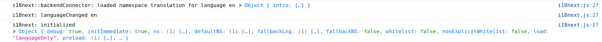
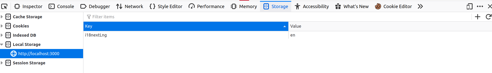

# Internationlisation in React applications
Internationlisation allows us to translate our website in multiple languages. There are only a few steps required in order to achieve that. In this demo we are going to use the local storage in order to persist the language (session storage would be an alternative).

These are the steps we are going to work on:
- Create React template project
- Initialise i18next with settings/language
- Use i18next to display messages/content based on the language
- Create json files that contain translation messages
- Modify dropdown to update the language in the website
- Add routing for multi page experience

Let's start by creating a react application with create-react-app and navigate to the project directory.

```
$ npx create-react-app react-i18n-demo
$ cd react-i18n-demo
```
 
Delete everything in the App.js and let's create a simple navigation which contains the language dropdown.

```javascript
import React from 'react';
import Language from './components/Language/Language';
import './App.css';

const App = () => {
  return (
    <div className="App">
      <nav style={{ height: '80px', backgroundColor: 'rgb(253, 117, 19)' }}>
        <div style={{ float: 'right', marginTop: '30px', marginRight: '20px' }}>
          <Language />
        </div>
      </nav>
    </div>
  );
};

export default App;
```

The next step is to create the Language component with the help of material-ui select component. Notice that this file is created in <i>src/components/Language/</i> . Let's start by installing material-ui/core.
```
$ npm install --save @material-ui/core
```

Now let's move on to the Language component which is the dropdown for the language selection. The selection is persisted in the state through the useState hook and the languageHandler allows us to update our selection.

```javascript
import { FormControl, MenuItem, Select } from '@material-ui/core';
import React, { useState } from 'react';

const Language = () => {
  const [dropdownLang, setDropdownLang] = useState('en');

  const languageHandler = event => {
    const newLanguage = event.target.value;
    if (dropdownLang !== newLanguage) {
      setDropdownLang(newLanguage);
    }
  };

  return (
    <FormControl style={{ minWidth: 120 }}>
      <Select value={dropdownLang} onChange={languageHandler}>
        <MenuItem value="en">English</MenuItem>
        <MenuItem value="el">Ελληνικά</MenuItem>
        <MenuItem value="es">Español</MenuItem>
        <MenuItem value="it">Italiano</MenuItem>
      </Select>
    </FormControl>
  );
};

export default Language;
```

We continue with the Intro and Flag components. The former is a simple component that renders a message and the latter displays a relevant image. For that we found some svg images and imported them in our project.
```javascript
import React from 'react';

const Intro = () => {
  return <h1>Welcome in React!</h1>;
};

export default Intro;
```

```javascript
import React from 'react';
import flagSvg from './en.svg';

const Flag = () => {
  return ;
};

export default Flag;
```

At this point our project template is completed and you will be able to update the language from the dropdown. However the message and the flag are not updated as they are hardcoded for now. The next step is to integrate with i18next in order to render the content dynamically. 

# i18n integration
In order to integrate with i18next we are going to need the following libraries:
- i18next
- react-i18next
- i18next-xhr-backend
- i18next-browser-languagedetector

```
$ npm install --save i18next react-i18next i18next-xhr-backend i18next-browser-languagedetector
```

Initially we need to configure/initialise <b>i18next</b>. The <b>i18next-xhr-backend</b> is responsible for loading the properties from the translation files. The <b>i18next-browser-languagedetector</b> as the name implies detects the language. We will come back to this library later on, as there are some interesting features we are going to use. Finally <b>react-18next</b> will be used widely in our project as it allows to read and update the i18next language. 

```javascript
import i18n from 'i18next';
import Backend from 'i18next-xhr-backend';
import LanguageDetector from 'i18next-browser-languagedetector';
import { initReactI18next } from 'react-i18next';

i18n
  .use(Backend)
  .use(LanguageDetector)
  .use(initReactI18next)
  .init({
    preload: ['en'],
    load: 'languageOnly',
    fallbackLng: 'en',
    debug: true,
    lowerCaseLng: true,
    detection: {
      order: ['localStorage']
    }
  });

export default i18n;
```

We chose to initialise with English which is also the fallback language but you could specify another, as well as, pre-load multiple languages. As we want to use the local storage in order to save the language in our website, we also need to give priority to that during the detection. Bare in mind that you can add more than one detectors, even custom ones.

<u>Note</u>: When a new language is set in i18next the relevant properties will be loaded in the memory. You can view that in the console if you have the debug enabled.

At this point you will be able see the i18next initialisation in the console.



But where is the language persisted? In your browser's developer console navigate to the Application (Storage if using Firefox) tab and then select Local Storage. You will see that the property i18nextLng is added there (the name can be overwritten with i18next configuration).



# Render content dynamically based on i18next language